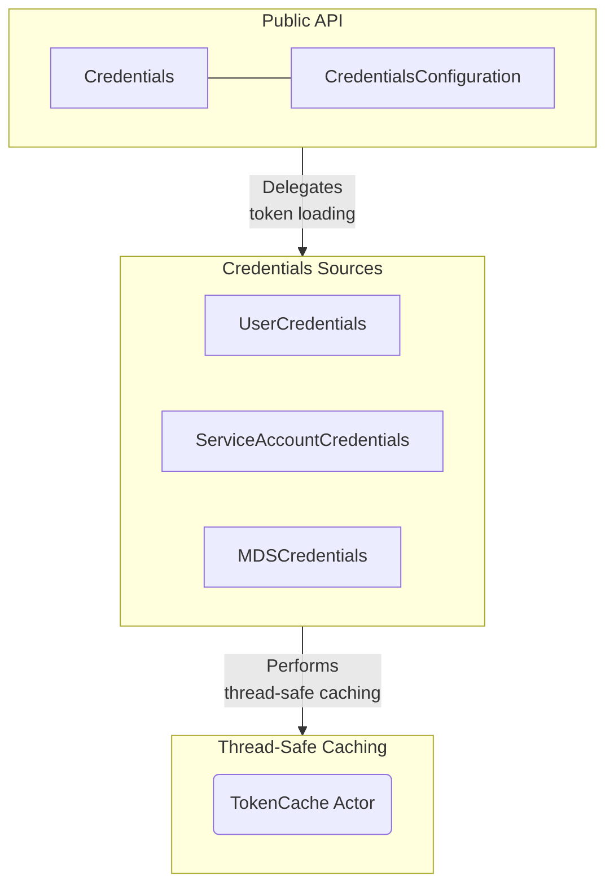

# Objective

Design a native Swift authentication library (`GoogleCloudAuth`) inside
`google-cloud-swift` (the `GoogleCloudAuth` target in the root package) to serve as the unified, type-safe, and
thread-safe entry point for all outgoing authenticated requests in a
Swift-idiomatic way.

***Out of scope:** - Impersonated credentials, Workload Identity Federation
(Amazon Web Services [AWS], OpenID Connect [OIDC]), API Keys, ID Token
verification, and signing arbitrary payloads. These are deferred to a future
phase.

# Background

Google Cloud client libraries require a unified, thread-safe, and performant
authentication mechanism to inject credentials (such as access tokens) into
outgoing HTTP requests.

Currently, developers must manually implement token retrieval, parsing, and
refresh logic or rely on unmanaged, heavy shims that introduce significant
tooling complexity and binary bloat into their build graphs.

By designing a native Swift Auth library, we leverage modern Swift language
features—such as Structured Concurrency, `async/await`, and Actors—to handle
token retrieval, background refreshing, and thread-safe caching natively. This
ensures optimal performance, minimal binary footprint, and developer experience
when building Google Cloud applications on Apple platforms and Linux.

# Requirements

## Functional Requirements

-   **Application Default Credentials (ADC)**: Resolves credentials
    automatically by checking standard environments (e.g.,
    `GOOGLE_APPLICATION_CREDENTIALS` environment variable, well-known local
    gcloud JSON configurations, or Metadata Server fallback).
-   **Credential Provider Support**: Loads both User Credentials (containing
    OAuth2 refresh tokens) and Service Account Credentials (containing private
    keys), and queries the Metadata Server.
-   **Token Caching**: Caches access tokens in memory and proactively refreshes
    them in the background before they expire.
-   **Transient Error Retries**: Retries transient network and server errors
    (500, 503, 408, 429) automatically during token retrieval.

## Non-Functional Requirements

-   **Thread Safety**: Token access, caching, and refresh mechanisms are
    completely thread-safe and free of data races.
-   **Public API Compatibility**: Maintains full compatibility with the Google
    API Extensions (GAX) `HTTPClient` and generated client packages in the
    mono-repo.
-   **Modern Swift Design**: Written for Swift 6+, utilizing native Structured
    Concurrency and Actor isolation instead of manual locking.

## Non-Requirements (Deferred)

-   Impersonated credentials, Workload Identity Federation (AWS, OIDC), API
    Keys, ID Token verification, and signing arbitrary payloads. These features
    are explicitly out of scope and deferred to a future phase.

# Overview

The authentication library is built around a protocol-oriented delegation model.
The public `Credentials` type acts as the external interface and delegates all
operations to a concrete credentials source resolved at initialization.

### Public API Surface

```swift
/// Defines the configurations for authenticating Google Cloud API requests.
public enum CredentialsConfiguration: Sendable {
  /// Automatically resolves credentials using Application Default Credentials (ADC) with optional overrides.
  ///
  /// - Parameters:
  ///   - quotaProjectID: A custom project ID used for billing and quota management.
  ///   - scopes: Optional OAuth2 scopes to request for the access token.
  ///   - universeDomain: Optional universe domain override.
  case adc(
    quotaProjectID: String? = nil,
    scopes: [String]? = nil,
    universeDomain: String? = nil
  )

  /// Explicitly queries the local Compute Engine Metadata Server (MDS) with optional overrides.
  ///
  /// - Parameters:
  ///   - endpoint: The metadata server base URL override (defaults to `http://metadata.google.internal`).
  ///   - scopes: Optional scopes requested from the metadata server.
  ///   - quotaProjectID: Optional project ID used for billing and quota.
  case mds(
    endpoint: URL? = nil,
    scopes: [String]? = nil,
    quotaProjectID: String? = nil
  )

  /// Explicitly refreshes User OAuth2 tokens using a local JSON credentials file located at the specified URL.
  case userKeyFile(URL)

  /// Explicitly refreshes User OAuth2 tokens using raw JSON credentials data in memory, with optional overrides.
  ///
  /// - Parameters:
  ///   - keyJSON: The raw User credentials JSON key data.
  ///   - tokenURI: The OAuth2 token refresh endpoint URI override.
  ///   - scopes: Optional scopes requested for the access token.
  ///   - quotaProjectID: Optional project ID used for billing and quota.
  case user(
    keyJSON: Data,
    tokenURI: URL? = nil,
    scopes: [String]? = nil,
    quotaProjectID: String? = nil
  )


  /// Explicitly signs tokens locally using a Service Account JSON key in memory, with optional overrides.
  ///
  /// - Parameters:
  ///   - keyJSON: The raw Service Account JSON key data.
  ///   - quotaProjectID: A custom project ID used for billing and quota.
  ///   - universeDomain: Google Cloud universe domain override.
  ///   - scopes: Optional scopes requested (exchanged locally via JWT claims).
  ///   - audience: Optional custom target audience override.
  case serviceAccount(
    keyJSON: Data,
    quotaProjectID: String? = nil,
    universeDomain: String? = nil,
    scopes: [String]? = nil,
    audience: String? = nil
  )

  /// Returns a stub credential that provides no headers (unauthenticated).
  case anonymous
}

/// The public entry point to authenticate Google Cloud API requests.
public struct Credentials: Sendable {
  /// Initializes credentials using a specific configuration (defaults to automatic ADC resolution).
  ///
  /// - Parameter configuration: The credentials configuration overrides.
  /// - Throws: An error if loading or parsing the credentials fails.
  public init(configuration: CredentialsConfiguration = .adc()) throws

  /// Asynchronously retrieves the request headers required to authenticate a request.
  public func headers() async throws -> AuthHeaders

  /// Retrieves the universe domain associated with the credentials.
  public func universeDomain() async -> String?
}
```

### Internal Architectural Structures

The following diagram maps out the high-level layers of the authentication
library:



--------------------------------------------------------------------------------

# Detailed Design

## 1. Public API & Protocols

The library delegates credential resolution to concrete internal sources
conforming to the `CredentialsProvider` protocol. This internal protocol
handles token retrieval and formatting.

HTTP headers are represented as `AuthHeaders` (which is a typealias for an
array of key-value tuples `[(String, String)]`) rather than a dictionary, ensuring
native support for duplicate header names (which HTTP permits) and full backward
compatibility with the GAX package and test suites.

```swift
/// A type that can provide authentication headers for Google Cloud API requests.
protocol CredentialsProvider: Sendable {
  /// Asynchronously retrieves the request headers required to authenticate a request.
  ///
  /// - Returns: An array of key-value tuples representing HTTP headers.
  func headers() async throws -> AuthHeaders

  /// Retrieves the universe domain associated with the credentials.
  func universeDomain() async -> String?
}
```

The public `Credentials` API signature is defined in the `# Overview` section.
Internally, `Credentials` is backed by an instance of `CredentialsProvider`
resolved at load time:

```swift
public struct Credentials: Sendable {
  private let credentialsProvider: any CredentialsProvider

  internal init(credentialsProvider: any CredentialsProvider) {
    self.credentialsProvider = credentialsProvider
  }
}
```

--------------------------------------------------------------------------------

## 2. Internal Architectural Structure

### A. Application Default Credentials (ADC) Resolver

The `ADC` utility resolves the appropriate credentials source at
initialization, following standard search paths defined in
[AIP-4110: Application Default Credentials](https://google.aip.dev/auth/4110):

1.  **Environment Variable**: `GOOGLE_APPLICATION_CREDENTIALS` (checks path;
    throws error if set but invalid).
2.  **Well-Known Path**: `~/.config/gcloud/application_default_credentials.json`
    (or Windows equivalent).
3.  **Lazy Metadata Server (MDS) Fallback**: If no local configuration is found,
    defaults to an `MDSCredentials` source. MDS availability is checked lazily
    at token fetch time to handle Google Compute Engine (GCE) / Google
    Kubernetes Engine (GKE) startup delays gracefully.

### B. Structured Credentials Sources

We implement three concrete, structural credentials sources that satisfy
`CredentialsProvider` to encapsulate different authentication channels:

-   **`UserCredentials`**: Resolves and refreshes tokens using User OAuth2
    credentials JSON key data.
-   **`ServiceAccountCredentials`**: Authenticates API requests using local JSON
    Web Token (JWT) assertions signed by a Service Account private key.
-   **`MDSCredentials`**: Resolves instance credentials from the local Compute
    Engine Metadata Server.

Each credentials source delegates actual token storage and refreshing to a shared
`TokenCache` actor to preserve isolation boundaries.

### C. Internal Network Client (AuthHTTPClient)

To simplify request dispatching, JSON decoding, and error handling across our
token providers while keeping `GoogleCloudAuth` completely isolated from
`GoogleCloudGax`, we implement a lightweight, internal `AuthHTTPClient`.

This internal client encapsulates the following networking policies:

-   **Linux Portability**: Conditionally imports `FoundationNetworking` under
    `#if canImport(FoundationNetworking)` to support Linux targets.
-   **Secure Ephemeral Sessions**: Forces the use of `URLSession(configuration:
    .ephemeral)` for its underlying session, preventing the OS from caching
    sensitive tokens locally.
-   **Defense-in-Depth Request Caching Bypass**: Centralizes request-level
    overrides by explicitly setting `request.cachePolicy =
    .reloadIgnoringLocalCacheData` on all outbound queries.
-   **Acyclic Boundary Safety**: Performs raw network queries directly via
    `URLSession`, ensuring `GoogleCloudAuth` remains independent of
    `GoogleCloudGax`.
-   **Generic Decoding**: Decodes generic JSON responses using a default
    `JSONDecoder` configured with a `.convertFromSnakeCase` key decoding
    strategy.
-   **Plain-Text Support**: Supports retrieving raw UTF-8 string responses
    (bypassing JSON decoding) to accommodate GCE Metadata Server endpoints
    (like ID tokens and emails) that return plain text.

--------------------------------------------------------------------------------

## 3. Caching & Refresh Architecture (TokenCache Actor)

To prevent data races and thundering herd problems (where concurrent
asynchronous requests to a client library try to fetch a new token
simultaneously), we isolate the cache state inside a Swift `actor`.

The `TokenCache` is designed as a **single, generic, and highly reusable
thread-safe implementation** that wraps *any* underlying credential provider
conforming to `TokenProvider`.

To align with the Rust implementation, the `TokenCache` uses a **proactive
background-refresh model**:

-   **Background Refresh Loop**: Upon initialization, the cache spawns a
    persistent background `Task` that runs an infinite loop to actively maintain
    token validity.
-   **Refresh Logic**:
    -   If the token has an expiration and it is **more than 4 minutes** in the
        future, the background task sleeps until 4 minutes before expiration
        (`expiry - 4 minutes`).
    -   If the token expires in **less than 4 minutes** but more than 10
        seconds, it sleeps for 10 seconds and tries again. This handles Metadata
        Server edge cases where short-lived tokens are repeatedly returned.
    -   If a fetch fails with a **transient error**, it sleeps for 10 seconds
        and retries.
    -   If the error is **permanent**, the loop terminates to prevent endless
        useless polling.
-   **Thundering Herd Protection**: Callers calling `token()` return the cached
    token if valid and not expired. If missing or expired, they await a shared
    active refresh task, ensuring only one network request is executed even
    under heavy concurrent load.

--------------------------------------------------------------------------------

## 4. Transient Error Retry Engine

To handle transient errors (such as standard transient HTTP status codes 500,
503, 408, 429), we implement a reusable structured exponential backoff retry
engine.

This engine enforces the following behaviors, matching the Rust retry
specifications exactly:

-   **Default Attempts Limit**: Retries up to **3 attempts** (the initial
    execution + 2 retry attempts) on transient exceptions before exhausting.
-   **Exponential Backoff Scaling**: Automatically schedules retry attempts,
    progressively scaling the backoff delay using an initial delay of **1.0
    second** and a scaling multiplier of **2.0** (exponentially doubling delay
    time after each failed attempt, e.g., 1.0s, 2.0s, 4.0s).
-   **Maximum Delay Cap**: Caps the maximum backoff delay at **60.0 seconds** to
    prevent excessive delays on long retry loops.
-   **Full Jitter**: Applies a random jitter factor between `0.0` and `1.0`
    to the calculated backoff delay before sleeping, preventing thundering
    herd problems when many clients retry simultaneously.
-   **Provider-Specific Configurable Settings**: Supports specialized overrides
    depending on the credential provider's environment. For example, local
    Metadata Server (MDS) queries reside on the local hypervisor and require
    different, highly aggressive or linear backoff settings (or zero retries for
    environment probing) to prevent hangs on local developer workstations. All
    retry and backoff parameters are decoupled, allowing providers to configure
    and apply custom retry settings as needed.
-   **Custom Retry Predicates**: Uses decoupled, isolated `@Sendable` closure
    filters (`isRetryable: (Error) -> Bool`) to identify transient network
    dropouts or status code exceptions.
-   **Immediate Task Cancellation Rethrows**: Catches `CancellationError` and
    rethrows it immediately, bypassing sleep delays and retry loops to prevent
    ghost network requests once a task is cancelled.

--------------------------------------------------------------------------------

# Implementation details

### Files to Add:

-   `Sources/GoogleCloudAuth/ADC.swift`: Standard Google API
    Improvement Proposal (AIP)-4110 file loading and evaluation logic.
-   `Sources/GoogleCloudAuth/TokenCache.swift`: Actor-based token
    caching and task-sharing implementation.
-   `Sources/GoogleCloudAuth/Http/AuthHTTPClient.swift`:
    Centralized secure and Linux-compatible HTTP request dispatcher.
-   `Sources/GoogleCloudAuth/Providers/UserCredentials.swift`:
    Encapsulates User OAuth2 provider facade.
-   `Sources/GoogleCloudAuth/Providers/ServiceAccountCredentials.swift`:
    Encapsulates Service Account provider facade.
-   `Sources/GoogleCloudAuth/Providers/MDSCredentials.swift`:
    Encapsulates Metadata Server provider facade.

### Files to Delete:

-   Former `rust_auth_core/` directory from the standalone auth package
-   `Sources/RustAuthCoreBridge/`
-   `Sources/RustAuthCoreFFI/`

### Files to Modify:

-   `Package.swift`:
    -   Remove legacy shims and declarations.
    -   Declare `GoogleCloudAuth` as a pure Swift target depending on project
        crypto utilities for Linux compatibility.
-   `Sources/GoogleCloudAuth/Credentials.swift`: Rewrite to use
    native providers.

--------------------------------------------------------------------------------

# Alternatives considered

We evaluated the following alternatives when arriving at this design proposal:

### Alternative 1: Using Third-Party Cryptography/JWT Libraries

We considered using an existing open-source Swift JWT or OAuth library to handle
token generation and request signing because it reduces our initial hand-crafted
coding overhead. We went with a native, custom-tailored Auth engine because:

-   It eliminates external dependency risks and potential compilation/build
    breaks in developer environments.
-   It minimizes the library's overall dependency footprint.
-   It allows us to tightly and safely integrate with our specific `TokenCache`
    actors, retry engines, and GAX conventions natively.

### Alternative 2: Implementing OAuth2 Token Exchange for Service Accounts

We considered executing the OAuth2 token exchange flow (sending signed JWT
assertions to `oauth2.googleapis.com/token` via a POST network request) to fetch
standard access tokens because of its universal support across all Google Cloud
APIs and compliance with traditional OAuth2 client flows. We went with the
Self-Signed JWT (SSJ) direct Bearer auth because:

-   Exchanging JWT assertions for access tokens is a deprecated flow for
    server-to-server communication on Google Cloud.
-   Using a Self-Signed JWT directly as the Bearer token is Google Cloud
    Platform (GCP)'s modern best practice, eliminating extra network roundtrips
    and significantly improving latency and reliability.

--------------------------------------------------------------------------------

# Risks and Mitigation Strategies

### Risk: Breaking Changes in Generated Client Libraries

-   **Mitigation**: We preserve the exact interface of `Credentials` (including
    standard initializers and returning `AuthHeaders` from `.headers()`),
    ensuring GAX `HTTPClient` and generated clients compile without manual
    modifications.

--------------------------------------------------------------------------------

# Corpus of information

-   [AIP-4110: Application Default Credentials](https://google.aip.dev/auth/4110)
-   [AIP-4111: Self-Signed JWTs](https://google.aip.dev/auth/4111)
-   [Rust Auth Library Design (Google Doc)](https://docs.google.com/document/d/1_y0XhisC7S6TTxOTfatktcXMulD_5MWy6YxNiM3ouzk/edit?tab=t.0#heading=h.askag03ltryj)
-   [Rust Auth Library Project Plan (Google Doc)](https://docs.google.com/document/d/13uSDA_Ys5DqsiBjiVwza547nnljJn7u5nws5fr2ijnU/edit?resourcekey=0-bx8WSvAafKevZFy4B3S7rA&tab=t.0#heading=h.c3agxzix6b8l)
-   [google-cloud-swift mono-repo structure](file:///usr/local/google/home/westarle/src/citc/rewrite-auth-library-swift/google-cloud-swift/Package.swift)
